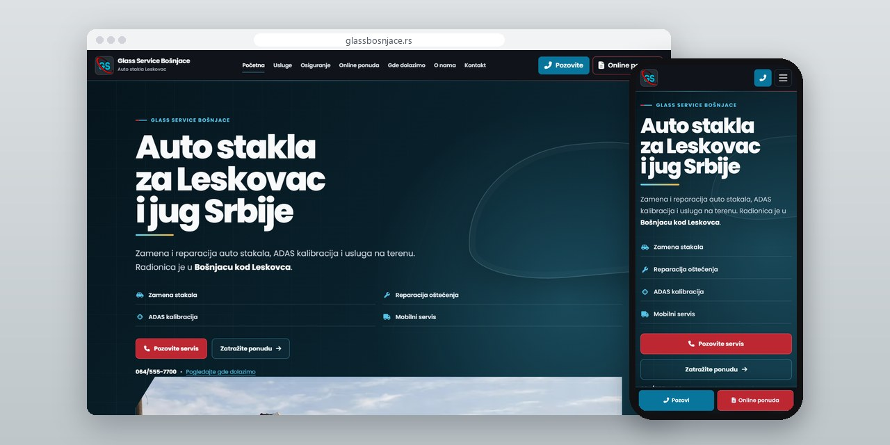
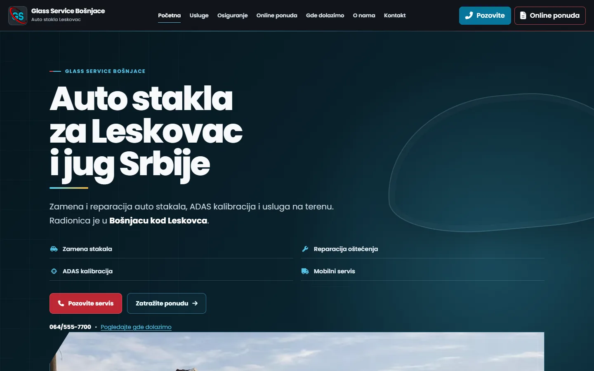
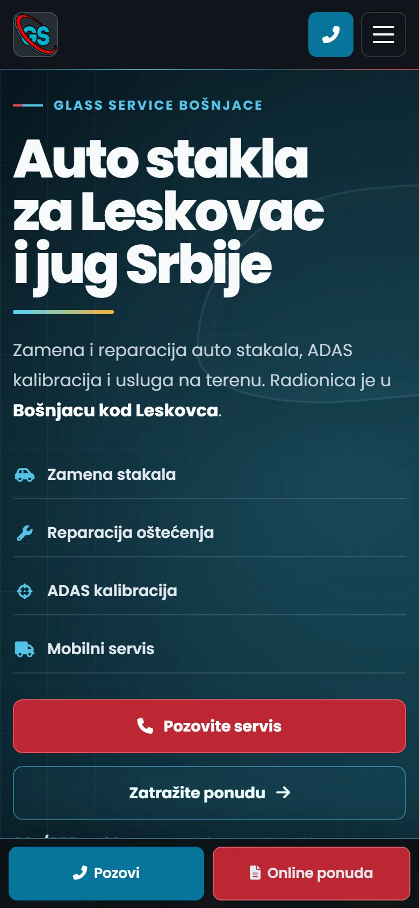
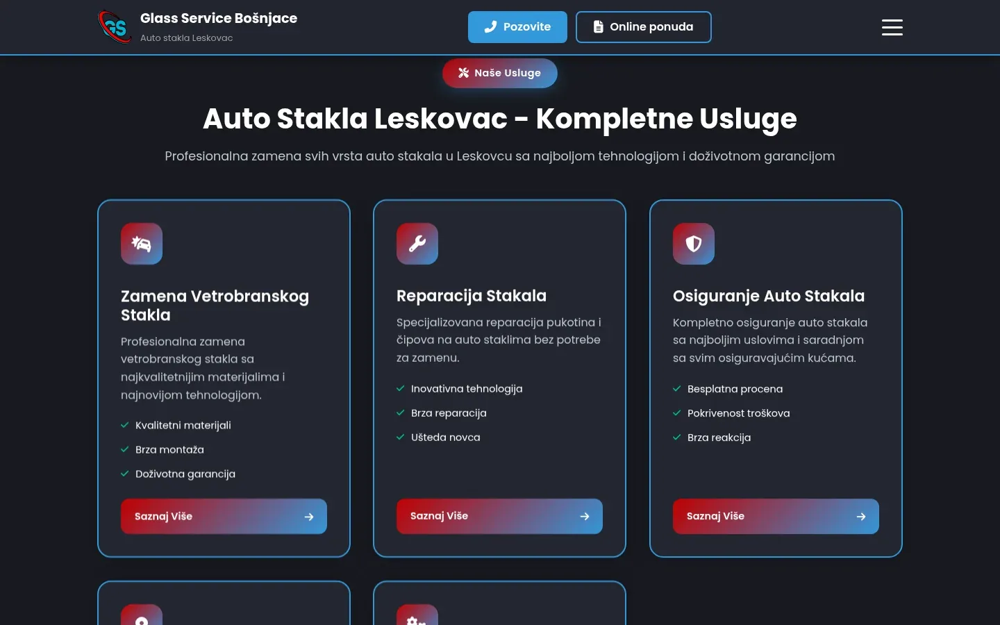
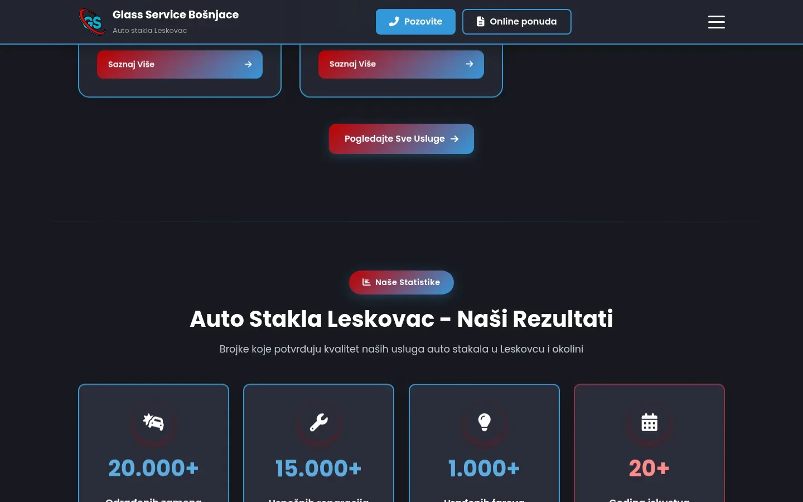

# Glass Service Bošnjace

Sajt auto-staklarske radnje kod Leskovca: online ponuda u pet koraka umesto cenovnika, strane za mesta koja pokriva i osiguranje objašnjeno jednostavno.

**[glassbosnjace.rs](https://glassbosnjace.rs/)** · [Studija slučaja](https://svilenkovic.rs/radovi/glass-service-bosnjace) · [English](README.md)

> [!NOTE]
> Klijentski projekat. Izvorni kod pripada klijentu i čuva se u privatnom repozitorijumu. Ova stranica opisuje šta sam uradio i kako.

<table>
  <tr><td><b>Klijent</b></td><td>Glass Service Bošnjace</td></tr>
  <tr><td><b>Delatnost</b></td><td>Zamena i reparacija auto stakala, ADAS kalibracija</td></tr>
  <tr><td><b>Lokacija</b></td><td>Bošnjace, Leskovac</td></tr>
  <tr><td><b>Vrsta</b></td><td>Sajt sa više strana</td></tr>
  <tr><td><b>Moj deo posla</b></td><td>Dizajn, izrada, SEO, hosting i održavanje</td></tr>
  <tr><td><b>Tehnologije</b></td><td>PHP 8.3, nginx, PHPMailer</td></tr>
</table>

## O projektu

Glass Service Bošnjace menja i reparira vetrobranska, bočna i zadnja stakla, kalibriše ADAS kamere posle zamene i izlazi na teren po jugu Srbije. Ljudi zovu istog dana kad staklo pukne, često sa puta, pa broj telefona stoji na svakom ekranu. Dobar deo posla ide preko osiguranja, a papirologija oko toga ima svoju stranu.

Cenovnik bi bio netačan, jer cena zavisi od konkretnog stakla, senzora, grejača i kamere. Umesto njega postoji forma za ponudu u pet koraka: klijent, usluga, lokacija, vozilo, pregled. Broj šasije se proverava na 17 znakova, za reparaciju su potrebne fotografije oštećenja, a ako je pukotina već jednom rađena, forma objasni zašto ne može ponovo i ponudi da zahtev prebaci na zamenu. Upiti odlaze sa domena radnje, potpisani njegovim DKIM ključem.

## Šta sam uradio

- Strana usluga napisana ispočetka kad sam otkrio da je prazan omotač: PHP include je tiho padao, a devetnaest adresa je vraćalo 200 bez ičega između zaglavlja i podnožja
- Jedno mesto odakle se učitavaju skripte, pošto se ista skripta forme izvršavala tri puta i slala tri mejla po jednom slanju
- Vraćena slova sa kvačicama na stranama za mesta, posle ranijeg prolaza koji je izbacio sve van osnovnog ASCII skupa: oko 430 ispravki u dva kruga, uključujući naslove i strukturisane podatke
- Strane za mesta koja radnja pokriva, svaka o udaljenosti i izlasku na teren baš do tog mesta, i posebna strana za ADAS kalibraciju
- Dodato slušanje na IPv6, jer mobilne mreže koje prvo idu preko IPv6 uopšte nisu stizale do sajta
- Interna poslovna aplikacija za termine, ponude, lager i račune, odvojena od javnog sajta

## Merenja

| | Performanse | Pristupačnost | Dobre prakse | SEO |
| :-- | :-: | :-: | :-: | :-: |
| Telefon | 86 | 100 | 100 | 100 |
| Desktop | 97 | 100 | 100 | 100 |

PageSpeed Insights, laboratorijsko merenje živog sajta, septembar 2026. Sigurnosna zaglavlja: 6 od 6. HTML validator: bez grešaka. axe provera pristupačnosti: bez prekršaja. Strukturisani podaci: `AutoRepair`.

## Snimci ekrana

<table>
  <tr>
    <td width="68%" valign="top"></td>
    <td width="32%" valign="top"></td>
  </tr>
</table>

Kompletne usluge: zamena vetrobranskog stakla, reparacija i rad preko osiguranja

Sekcija "Naši rezultati": brojke koje radnja ističe o svom radu

---

Izrada: [D. Svilenković](https://svilenkovic.rs).
